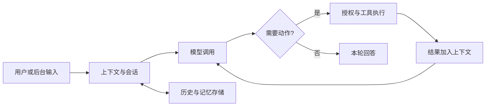

# Agent 学习路线：浅读 OpenWorker，主学 Hermes

资料核对日期：2026-09-23。

**Hermes 官方入口：**

- [GitHub 源码：NousResearch/hermes-agent](https://github.com/NousResearch/hermes-agent)
- [官方学习路线 Learning Path](https://hermes-agent.nousresearch.com/docs/getting-started/learning-path)
- [官方架构导读 Architecture](https://hermes-agent.nousresearch.com/docs/developer-guide/architecture)
- [官方文档首页](https://hermes-agent.nousresearch.com/docs/)

目标：先用当前项目认识 Agent 的执行与审批，再借助 Hermes 官方文档系统学习。采用 **读文档 → 做小实验 → 带问题查源码** 的顺序，避免从目录第一项开始逐文件阅读。

本文中的阅读顺序、时间预算和项目选择是学习建议，不是性能排名。外部资料依据官方文档；OpenWorker 的文件说明依据当前工作区。官方在线文档与本地版本可能不同，深入实验时记录使用的 tag 或 commit。

## 导航

- [1. 项目怎么选](#1-项目怎么选)
- [2. Hermes 有哪些学习文档](#2-hermes-有哪些学习文档)
- [3. Hermes 的五次学习练习](#3-hermes-的五次学习练习)
- [4. OpenWorker 浅读清单](#4-openworker-浅读清单)
- [5. 两个项目如何对照](#5-两个项目如何对照)
- [6. 如何让 AI 带着读](#6-如何让-ai-带着读)
- [7. 今天从哪里开始](#7-今天从哪里开始)

## 1. 项目怎么选

先按想解决的问题选项目，不把产品热度、代码可读性和工程能力合成一个排名。

| 项目 | 学习用途 | 在这条路线中的位置 |
|---|---|---|
| OpenWorker | 模型与工具循环、确定性权限、人工审批、事件驱动界面 | 当前项目，先看几个核心点 |
| [Hermes Agent 源码](https://github.com/NousResearch/hermes-agent) | 持续运行助手的上下文、记忆、技能、工具和后台入口 | 主学项目，使用官方文档带路 |
| Codex | 编码 Agent 的运行控制与应用集成 | 后续研究会话、事件、中断、审批等接口 |
| DeepSeek Harness | Agent 能力的插件化和组合方式 | 想设计扩展平台时深入 |
| nanobot | 个人助手模块如何围绕执行循环组织 | 可选对照，不是必修前置 |
| mini-swe-agent | 紧凑的模型—动作—反馈循环 | 如果还不理解循环，再用它补课 |

选择 Hermes 的理由是它覆盖了通用助手所需的多个子系统，并且已有成体系的学习入口；这不等于已经证明它的代码质量、可靠性或执行效果胜过其他项目。[Hermes 官方文档](https://hermes-agent.nousresearch.com/docs/)

Codex 的开源部分包括 CLI、app-server 和 SDK；app-server 提供持续会话、流式事件、中断、工具与审批等集成能力。研究时区分运行框架与模型服务。[Codex 官方平台介绍](https://developers.openai.com/blog/codex-as-a-platform)

DeepSeek Harness 通过 Cordis 组织插件，将模型、工具、会话、沙箱、存储、循环和 UI 等作为可组合能力；当前官方标注为开发者预览，学习时要预期接口变化。[官方架构介绍](https://www.deepseek.com/harness/en/)、[仓库](https://github.com/deepseek-ai/deepseek-harness)

nanobot 当前也包含界面、记忆、自动化和多 Agent 等能力，不能把整个项目视作很小的示例。mini-swe-agent 则适合观察精简控制流程；其“约百行”的描述指基础 Agent 类，不是整个仓库。[nanobot](https://github.com/HKUDS/nanobot)、[mini-swe-agent](https://github.com/SWE-agent/mini-swe-agent)

本文不据讨论频率或 GitHub 星数推断实际使用人数，也不要求先学完一个项目才能开始另一个。

## 2. Hermes 有哪些学习文档

**有，而且包含专门的源码导读，不必直接啃整个仓库。**

这里核实的是官方英文页面；本文件提供中文阅读导航和练习，不是官方文档的全文翻译。先收藏下面的前三项，其余用到再打开。

### 中文资料入口：区分官方与社区

官方仓库已提供 [中文 README](https://github.com/NousResearch/hermes-agent/blob/main/README.zh-CN.md)，适合认识功能和上手；这不等于核心源码已有完整的中文逐行注释或中文源码课程。当前抽查的核心 Python 文件仍以英文注释为主。

下面是独立中文社区站的学习资料，不是 Nous Research 官方文档站：

- [中文学习路径](https://hermesagent.org.cn/docs/getting-started/learning-path)
- [中文架构导读](https://hermesagent.org.cn/docs/developer-guide/architecture)
- [中文 Agent Loop 内部机制](https://hermesagent.org.cn/docs/developer-guide/agent-loop)
- [中文提示词组装](https://hermesagent.org.cn/docs/developer-guide/prompt-assembly)

建议先用中文建立概念，再对照下方官方英文资料和当前源码。该站还提供自己的发行与安装入口，阅读其教程不等于需要改用社区发行版。

**更新及时性抽查（2026-09-23）：上述社区中文开发者资料已有明确滞后，适合作为概念辅助，不应直接作为当前源码定位指南。**

| 抽查点 | 中文页面 | 当前官方英文文档或源码 |
|---|---|---|
| 架构与执行循环 | 仍描述 `run_agent.py` 包含约 9,200 行核心循环 | `run_agent.py` 是对外入口，循环已拆至 `agent/conversation_loop.py` 和 `agent/turn_*.py` |
| 提示词组装 | 仍列出旧的十项拼接顺序 | 已采用 `stable → context → volatile` 三层组织，并有 `agent/system_prompt.py` |

证据：[中文架构](https://hermesagent.org.cn/docs/developer-guide/architecture)、[中文执行循环](https://hermesagent.org.cn/docs/developer-guide/agent-loop)、[官方执行循环](https://hermes-agent.nousresearch.com/docs/developer-guide/agent-loop)、[中文提示词组装](https://hermesagent.org.cn/docs/developer-guide/prompt-assembly)、[官方提示词组装](https://hermes-agent.nousresearch.com/docs/developer-guide/prompt-assembly)、[当前组装源码](https://github.com/NousResearch/hermes-agent/blob/main/agent/system_prompt.py)。

本次没有获得这些中文页面可靠的逐页同步日期或对应提交，无法量化落后天数，也不能据此断言整站停止维护。搜索结果的抓取时间不等于内容更新时间。学习当前实现时，优先用官方英文原文的浏览器翻译或带版本的中文讲解，并在涉及文件位置、命令、参数时核对源码。

### 2.1 第一轮必读：建立整体认识

| 顺序 | 官方资料 | 带着什么问题读 | 读完留下什么 |
|---|---|---|---|
| 1 | [Learning Path：学习路线](https://hermes-agent.nousresearch.com/docs/getting-started/learning-path) | 我是学使用、扩展工具，还是执行原理？ | 选定一条路线 |
| 2 | [Quickstart：快速开始](https://hermes-agent.nousresearch.com/docs/getting-started/quickstart) | 一次交互从哪里开始，如何确认配置可用？ | 一次成功对话，或清楚的启动流程笔记 |
| 3 | [Architecture：整体架构](https://hermes-agent.nousresearch.com/docs/developer-guide/architecture) | 入口、执行核心、工具、存储如何连接？ | 自己画一张五到七个框的图 |
| 4 | [Agent Loop Internals：执行循环](https://hermes-agent.nousresearch.com/docs/developer-guide/agent-loop) | 模型请求工具后，程序怎样再次调用模型？ | 一次工具调用的时序图 |
| 5 | [Using Hermes as a Python Library：程序调用](https://hermes-agent.nousresearch.com/docs/guides/python-library) | 绕开复杂界面后，最小调用是什么？ | 确认 `chat()` 与 `run_conversation()` 的差别 |

Learning Path 按使用目标和经验程度组织资料，适合选路线；Architecture 负责建立模块地图，Agent Loop 负责追踪执行流程。不要把这三份资料当作需要背诵的 API 列表。

### 2.2 第二轮：上下文为什么会影响行为

| 官方资料 | 最值得研究的问题 |
|---|---|
| [Prompt Assembly：提示词组装](https://hermes-agent.nousresearch.com/docs/developer-guide/prompt-assembly) | 固定提示、项目上下文和临时信息如何组织？为什么顺序影响缓存？ |
| [Persistent Memory：持久记忆](https://hermes-agent.nousresearch.com/docs/user-guide/features/memory) | “说记住了”和“确实持久化”有什么区别？新旧会话看到的信息是否一致？ |
| [Working with Skills：技能实践](https://hermes-agent.nousresearch.com/docs/guides/work-with-skills) | 技能何时加载，怎样把一个重复任务变成工作说明？ |
| [Session Storage：会话存储](https://hermes-agent.nousresearch.com/docs/developer-guide/session-storage) | 历史如何保存和恢复？它与记忆是什么关系？ |

先用三个不同问题区分三种状态：

- **会话历史**：这段对话发生过什么？
- **长期记忆**：未来新会话需要知道什么事实？
- **技能**：再遇到某类任务，应该怎样做？

Hermes 的基础记忆文档描述了会话开始时加载的记忆快照；会话内通过工具更新后会写入磁盘，但缓存提示里的快照不会随每次写入自动改写。实验时观察真正的工具调用和存储变化，不能只凭一句“我记住了”判断成功。[记忆机制说明](https://hermes-agent.nousresearch.com/docs/user-guide/features/memory)

Skill 按需加载正文，适合保存做事的方法；技能目录或索引本身也有上下文成本，不能把“按需加载”理解为所有阶段都零 token。[技能实践](https://hermes-agent.nousresearch.com/docs/guides/work-with-skills)

### 2.3 后续专题从哪里找

消息 Gateway、Cron、MCP、子 Agent 和插件扩展，按需要从 [Learning Path](https://hermes-agent.nousresearch.com/docs/getting-started/learning-path) 进入对应专题。

官方也提供 [文档索引 llms.txt](https://hermes-agent.nousresearch.com/docs/llms.txt)，适合让 AI 帮你定位资料。它是索引，不是需要从头读到尾的教材。首次学习无需一次加载全部文档。

## 3. Hermes 的五次学习练习

下面是自拟练习，不是官方课程承诺。每次只验证一个问题；耗时取决于环境和基础，安装问题可单独处理。

### 第一次：从使用场景认识组件

先读 Quickstart 和 Architecture。若已配置好模型，准备一个只有两三个文本文件的练习目录，请助手读取内容并回答一个可核对的问题。

观察：输入从哪里进来？有没有调用工具？最终答案能否对应文件内容？

产出：画出“输入入口 → Agent → 模型 → 工具 → 结果返回”，然后标出存储在旁边的哪个位置。

没有安装时可以先做纸面学习；不要把官方文档中的示例当作自己已经跑通的结果。

### 第二次：看懂一次模型与工具往返

先读 Agent Loop，再看 Python Library 中的最小示例。当前文档区分返回最终文本的 `chat()` 与返回消息和元数据的 `run_conversation()`。[调用方式](https://hermes-agent.nousresearch.com/docs/guides/python-library)

对同一类简单任务，观察普通回答和需要工具的回答有何区别。若模型没有选择预期工具，记录这一事实，再用更明确的任务验证，避免把模型的自由选择误判为程序没有工具能力。

产出：一张三列记录表：模型返回了什么、程序执行了什么、下一次给模型增加了什么。

需要源码时，按当前官方导读定位：

- `run_agent.py`：`AIAgent` 的对外入口。
- `agent/conversation_loop.py`：主循环。
- `agent/turn_*.py`：单轮各阶段的处理。

这些是当前官方文档给出的路径，具体以所学版本为准；不要套用旧教程“整个循环都在 run_agent.py”这一印象。[Agent Loop Internals](https://hermes-agent.nousresearch.com/docs/developer-guide/agent-loop)

### 第三次：用实验区分历史与记忆

先读 Persistent Memory。让助手用记忆工具保存一条无敏感性的测试偏好，检查工具是否真的成功，再新建会话验证。

观察四件事：原会话、磁盘记忆、新会话、历史检索分别保存或提供了什么。

产出：解释为什么继续旧对话与开启新对话是两个不同实验。不要将一次成功回忆推断为所有长期记忆场景都可靠。

### 第四次：做一个看得见效果的 Skill

先读 Working with Skills。设计一个“阅读笔记”技能，规定输出包含问题、结论、证据和待验证项；对同一份练习材料，比较加载前后的结果。

这是学习练习，先不用复杂外部集成，也不要求马上改 Python 核心。

产出：一份短技能说明和两次结果对照。回答：变化来自指令、工具，还是模型能力？Skill 是否真的被加载？

### 第五次：为一个现象查源码

从前四次记录里选一个问题，例如“为什么当前会话没有重新加载刚更新的记忆”。先读相应文档，再定位实现和相关测试。

一次只追踪：入口、状态读取、决策分支、结果保存。遇到无关重试或供应商分支先做标记，不急着展开。

产出：用自己的话写五句话说明该机制，并链接一个实现位置和一个测试。完成后再进入调度、消息网关或插件主题。

## 4. OpenWorker 浅读清单

本文中的 OpenWorker 指当前仓库。全面目录地图见 [项目学习手册](project-guide.zh-CN.md)，此处只选值得先看的部分。

### 4.1 先读文档：大约 20–30 分钟的预算

| 内容 | 阅读目的 | 停止条件 |
|---|---|---|
| [README](../README.md) 的 How it works、Governed by design、Repository layout | 知道产品解决什么、执行和审批在哪里发生 | 能用三句话介绍项目 |
| [项目学习手册](project-guide.zh-CN.md) 第 1、2、5 章 | 理解术语、目录和调用关系 | 能画出 UI、服务、引擎、模型、工具五部分 |
| [approval-guidance.md](approval-guidance.md) | 看角色工作说明如何影响 reviewer，以及不能授予哪些权力 | 能解释“工作说明不等于授权” |

这里的时间只是阅读预算，不是要求在规定时间内看完。

### 4.2 优先级 A：最值得看的四个点

#### A1. 用测试理解循环

打开 [tests/test_engine.py](../tests/test_engine.py)，按顺序看：

1. `ScriptedProvider`：用预设响应替代真实模型。
2. `_engine()`：组装模型、工具和权限。
3. `test_no_tool_turn`：不调用工具时发生什么。
4. `test_tool_turn_order_and_execution`：工具结果怎样回到对话。
5. `test_write_requires_approval_then_approved`：批准后才写入。
6. `test_denied_tool_yields_error_and_continues`：拒绝后继续，而不是整段会话直接崩溃。

**阅读价值**：将一个可能不稳定的真实模型行为变成可重复、可断言的程序行为。

**看到这里即可停**：能预测“批准”和“拒绝”两条路径中文件是否生成，以及哪些事件出现。

如果本地开发依赖已经准备好，可在仓库根目录运行：

```bash
.venv/bin/pytest tests/test_engine.py -q -k 'no_tool_turn or tool_turn_order_and_execution or write_requires_approval_then_approved or denied_tool_yields_error_and_continues'
```

没有环境也可先读断言；本指南并不表示这些命令已在当前工作区执行通过。

#### A2. 看结构化权限如何约束工具

对照 [tests/test_tools_permissions.py](../tests/test_tools_permissions.py) 与 [permissions.py](../coworker/permissions.py)，先找读取自动允许、写入审批、路径越界和计划模式四类行为；再看 [reviewer.py](../coworker/reviewer.py) 的职责说明。

**阅读价值**：分清模型提出动作、程序决定许可、人或 reviewer 作出审批这三层关系。

**看到这里即可停**：能解释 reviewer 为什么不能推翻硬拒绝，以及按钮本身为什么不是全部权限控制。

#### A3. 看引擎怎样与界面分开

打开 [events.py](../coworker/events.py)，查看事件枚举；再根据 A1 的测试在 [engine.py](../coworker/engine.py) 的 `TurnEngine.run()` 周围追一次成功读文件的路径。

**阅读价值**：理解引擎如何用事件表达进度，而不是直接依赖某个 React 组件。

**看到这里即可停**：认识 `TURN_START`、`TOOL_PROPOSED`、`PERMISSION_REQUIRED`、`TOOL_FINISHED`、`TURN_END` 的作用。枚举里还有流式事件，顶部早期注释不一定反映当前能力。

不要第一遍从 `engine.py` 第一行一直读到最后。

#### A4. 看角色、技能与执行代码的关系

并排打开：

- [AppSec Worker 的 manifest](../coworker/personas/builtin/appsec-worker/manifest.md)
- [semgrep-review 的 SKILL.md](../coworker/personas/builtin/appsec-worker/skills/semgrep-review/SKILL.md)
- [agent.py](../coworker/agent.py) 的 `build_engine()`，只看组装关系

manifest 描述角色与能力声明，Skill 描述工作步骤，组装函数把相关能力接入运行环境。这里的 AppSec Worker 声明了 `ships: false`，适合作为源码示例，不代表默认发布版界面一定可见。

**阅读价值**：认识配置、工作说明、执行机制之间的分工。

**看到这里即可停**：能说清为什么只写一句“请使用某工具”不会凭空安装工具或获得权限。这里只阅读安全扫描技能，不需要实际执行扫描。

### 4.3 优先级 B：有兴趣再选两项

| 文件 | 看什么 | 为什么值得看 |
|---|---|---|
| [tools/registry.py](../coworker/tools/registry.py) | 工具 Schema、注册和执行的接口 | 明白 Python 函数如何成为模型可请求的动作 |
| [providers/base.py](../coworker/providers/base.py) | `ProviderClient`、`AssistantTurn`、`ToolCall` | 理解不同供应商响应怎样被统一 |
| [conversations.py](../coworker/conversations.py) | SQLite 索引与 JSONL 日志 | 区分内存消息与持久化记录 |
| [toolresult.py](../coworker/toolresult.py) | 工具输出进入上下文前的体积限制 | 看见成本和上下文管理的具体工程措施 |
| [compaction.py](../coworker/compaction.py) | 出站上下文的压缩职责 | 理解完整历史和模型看到的历史可以不同 |
| [server/app.py](../coworker/server/app.py) 的 `ws_session()` / `run_turn()` | 事件广播和保存检查点 | 把引擎行为对应到前端可见状态 |

浅读阶段的取舍：优先 A1–A4；B 类选两项即可。无需把大型 `server/manager.py`、全部连接器、远程机器、团队看板、Rust 打包、语音模块作为第一轮任务。

### 4.4 浅读结束的自检

- [ ] 能说明一次 Turn 为什么会多次调用模型。
- [ ] 知道工具定义、工具执行、权限审批分别在哪里。
- [ ] 知道拒绝工具调用后系统可以继续对话。
- [ ] 能区分 Persona、Skill、Tool。
- [ ] 知道事件驱动的实时展示与持久化历史是不同路径。

做到这些，就可以先停下 OpenWorker，转向 Hermes 的文档路线。

## 5. 两个项目如何对照

这是概念对照，不表示两个项目实现相同或安全保证相同。

| 要研究的问题 | OpenWorker 的入口 | Hermes 的阅读入口 |
|---|---|---|
| 一轮执行如何推进 | `engine.py`、`test_engine.py` | Agent Loop Internals |
| 上下文怎样构造 | `agent.py`、`project.py`、`skills/` | Prompt Assembly |
| 工具如何暴露和分发 | `tools/registry.py` | Architecture 中工具链路及其专题链接 |
| 历史怎么恢复 | `conversations.py` | Session Storage |
| 长期知识如何复用 | `memory/`、`skills/` | Persistent Memory、Working with Skills |
| 动作为什么需要批准 | `permissions.py`、`reviewer.py` | 官方 Learning Path 中 Security 路线 |
| 后台任务从哪进入 | `automation/`、`server/manager.py` | 官方 Learning Path 中 Automation 路线 |

可以画一张共用的概念图，再用不同颜色标出每个项目的实现位置：



图是学习用的简化模型，省略了重试、压缩、中断、并发、恢复等分支。先解释主路径，再逐个补分支。

## 6. 如何让 AI 带着读

给 AI 一份文档、一条路径、一个可验证问题，比要求“讲懂整个仓库”更容易得到有用结果。

### 文档辅导提示词

```text
请阅读这份官方文档，按以下方式带我学习：
1. 用一个具体任务解释这个机制解决什么问题。
2. 用不超过六步描述执行流程。
3. 区分文档明确说明的事实与你的推断。
4. 给一个十分钟左右的小练习和成功判断标准。
5. 最后列出两个我应该能回答的问题。
先不要展开无关模块，也不要把示例描述成已运行的结果。
```

### 源码辅导提示词

```text
我正在理解“读取文件，然后请求写入但被拒绝”的 Agent 流程。
请先找一个现有测试，从测试入口追到核心实现。
每一步说明输入、状态变化、下一步和相关断言。
一轮最多解释三个函数，给出实际文件位置。
如果文档与当前版本代码不同，请明确指出。
```

### 学习记录模板

```text
本次问题：
参考文档 / 代码版本：
我预测会发生什么：
实际观察到什么（未运行就写未运行）：
负责这个行为的模块：
支持结论的工具结果或测试：
还有什么没弄懂：
```

当你能预测下一步，再用结果验证，阅读就不再只是认识函数名。

## 7. 今天从哪里开始

只安排三个动作：

1. 看 OpenWorker 手册的第 5 章调用链，再读 `test_engine.py` 中的批准与拒绝两个测试。
2. 打开 Hermes 的 [Learning Path](https://hermes-agent.nousresearch.com/docs/getting-started/learning-path) 和 [Architecture](https://hermes-agent.nousresearch.com/docs/developer-guide/architecture)，画一张自己的整体图。
3. 下次阅读从 [Agent Loop Internals](https://hermes-agent.nousresearch.com/docs/developer-guide/agent-loop) 开始，用一次读文件任务串起模型、工具和消息历史。

本轮文档整理没有安装 Hermes、配置账号或执行真实模型任务。上述练习供后续逐项开展。
