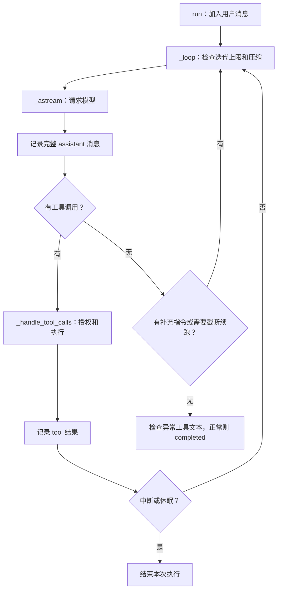

# OpenWorker engine.py 学习手册

本文面向“能读 Python，但看到几千行 Agent 引擎不知道从哪里下手”的读者。依据当前工作树的源码编写；`coworker/engine.py` 共 3,148 行。文中的行号是此版本的导航，后续变更时优先搜索函数名。

学习目标：能独立解释一次用户输入如何经过模型、权限、工具和历史记录，最终得到回答。第一遍只读第 1～5 节；异常恢复和产品功能留到第二遍。

## 1. 先把 3,148 行缩成一张地图

真正反复执行的函数是 `_loop()`（709～960 行，约 250 行）。其余代码主要负责准备输入、工具授权、执行、交互等待、恢复和展示。

| 阅读层次 | 源码位置（engine.py 行号） | 要回答的问题 |
|---|---|---|
| 第一遍 | `run()`，444；`_loop()`，709 | 输入怎样进入？为什么会再次调用模型？ |
| 第一遍 | `_handle_tool_calls()`，1189 | 工具请求怎样变成实际操作？ |
| 第一遍 | `_execute_sync()`，2119；`_record_result()`，2134 | 谁调用 Python 函数？结果怎样送回模型？ |
| 第二遍 | `_astream()`，1133；`_outbound_messages()`，2820 | 流式响应怎样接入？发给模型的历史是什么？ |
| 第二遍 | `_authorize()`，1696 | 允许、拒绝、人工审批怎样改变执行？ |
| 按问题读 | `_compact_now()`，1023；`retry()`，595；`resume()`，612 | 上下文变长、请求失败、重启后怎么继续？ |
| 暂时跳过 | `_handle_*` 交互处理器，2304～2773 | 团队、计划、连接器、目录请求怎样接入产品？ |

主要文件：

- [engine.py](../coworker/engine.py)：运行一次用户任务。
- [providers/base.py](../coworker/providers/base.py)：定义模型输入输出的统一接口。
- [tools/registry.py](../coworker/tools/registry.py)：工具名字、描述与实际函数之间的映射。
- [permissions.py](../coworker/permissions.py)：确定性的权限判断。
- [events.py](../coworker/events.py)：供调用方消费的运行事件。
- [test_engine.py](../tests/test_engine.py)：用预设模型回复讲清流程的小例子。

`agent.py` 的 `build_engine()` 负责组装依赖，核心循环在 `engine.py`。先理解引擎，再回头看组装，就不需要一开始追完角色、连接器和工具目录。

`engine.py` 里的关键注释和文档字符串现在采用中英对照：中文先解释阅读意图，英文保留原始工程语境和历史裁定。读源码时优先看中文段落，遇到 OPE 编号、owner ruling 或规范章节再对照英文原文。

## 2. 开始前只记住六个概念

| 概念 | 在源码里是什么 | 例子 |
|---|---|---|
| 用户轮次（Turn） | 一次 `run(user_input)` | “读取 a.txt 并告诉我内容” |
| 迭代（iteration） | `_loop()` 的一次循环体 | 调模型一次，必要时执行这一批工具 |
| 模型回复 | `AssistantTurn` | 文本、工具调用列表，也可同时有两者 |
| 工具请求 | `ToolCall(id, name, arguments)` | 请求 `read_file(path="a.txt")` |
| 历史 | `self.messages` | user、assistant、tool 等消息及附加信息 |
| 事件 | `Event(type, data)` | 通知界面“工具开始”“工具结束” |

**一个用户轮次可以有多次模型调用。** 名为 `AssistantTurn` 的对象只是一次模型回复，并不等于整个用户轮次。

**工具请求只是数据。** 模型输出工具名和参数后，程序还要做授权和函数调用。模型不会直接执行本地 Python 函数。

**历史与事件各有用途。** 工具结果写入历史，下一次模型才能看到；事件用于让界面或其他调用方及时展示进度。单独 `yield` 一个事件不等于保存了一条模型消息。

### `async`、`await`、`yield` 在这里分别做什么

```python
async for event in engine.run("读取 a.txt"):
    show(event)
```

`run()` 是异步生成器：调用方一边等待，一边取得事件。`yield` 暂时把事件交给调用方；调用方继续迭代后，引擎接着执行。`await` 表示等待模型、工具或人的决定时，让其他异步任务有机会运行。

注意 `_authorize()` 有个特殊约定：它先 `yield Event`，最后 `yield True/False`。`_handle_tool_calls()` 用 `isinstance(item, Event)` 区分事件和授权结果。这不是普通的“调用函数得到一个布尔返回值”。

## 3. 核心循环的缩略版

下面是**教学伪代码，不可直接替换源码**。暂时省略流式输出、审批事件、压缩、中断、截断续跑和特殊工具。

```python
async def run(user_input):
    messages.append(user_message(user_input))
    yield TURN_START

    for iteration in range(max_iterations):
        reply = await ask_model(messages, tool_schemas)
        messages.append(assistant_message(reply))
        yield ASSISTANT_MESSAGE

        if not reply.tool_calls:
            yield TURN_END_COMPLETED
            return

        for call in reply.tool_calls:
            if await authorize(call):
                result = await execute(call)
            else:
                result = {"error": "tool call not executed"}
            messages.append(tool_message(call.id, result))

        yield ITERATION_END
        # 新的工具结果已经进入 messages，下一次模型调用会看到它们。

    yield TURN_END_MAX_ITERATIONS
```

最关键的三步是：**记录模型请求 → 执行并记录工具结果 → 带着新历史再次调用模型。**



这张图突出主干；模型异常可以直接发出 `ERROR` 后返回，不能假设所有出口都经过 `TURN_END`。

## 4. 用一次读文件贯穿源码

先看 [test_engine.py](../tests/test_engine.py) 的 `test_tool_turn_order_and_execution`（104 行）。它预设两次模型回复：第一次请求 `read_file`，第二次回答 `it says hello`。

### 第一步：`run()` 接收输入

`run()` 先修复历史中缺少结果的旧工具调用，再追加当前用户消息，重置本轮状态、清理本轮授权，发出 `TURN_START`，然后把执行交给 `_loop()`。

此时历史可简写为：

```text
user: read a.txt
```

`instructions` 等初始化内容可能使真实历史还有其他消息；这里仅展示与例子相关的部分。

### 第二步：`_astream()` 请求模型

它从 registry 获取工具 schemas，用 `_outbound_messages()` 生成本次请求的历史，调用 `provider.stream(...)`。

模型看到工具名、说明和参数结构，返回类似：

```python
AssistantTurn(tool_calls=[
    ToolCall(id="call_1", name="read_file", arguments={"path": "a.txt"})
])
```

`_loop()` 把这次回复转换成 assistant 消息并追加到历史，然后发出 `ASSISTANT_MESSAGE`。这个事件也可能代表“模型提出了工具请求”，不能将它一律理解为最终回答。

### 第三步：授权并执行

`_handle_tool_calls()` 发出 `TOOL_PROPOSED`，通过 `_authorize()` 判断能否执行。测试里的工作区读文件不需要人工审批。

获准后，它发出 `TOOL_STARTED`，在线程里调用 `_execute_sync()`，后者调用：

```python
self.registry.execute(tool_call.name, tool_call.arguments)
```

注册表最后执行的是普通 Python 函数：

```python
spec.func(**(arguments or {}))
```

权限控制在引擎和 `PermissionEngine`，`ToolRegistry.execute()` 本身不负责授权。

### 第四步：把结果放回历史

`_record_result()` 会处理结果长度、展示附加信息、计时及审计，然后追加工具消息，并返回 `TOOL_FINISHED` 事件。

此时历史的核心结构是：

```json
[
  {"role": "user", "content": "read a.txt"},
  {"role": "assistant", "tool_calls": [
    {"id": "call_1", "type": "function", "function": {
      "name": "read_file", "arguments": "{\"path\":\"a.txt\"}"
    }}
  ]},
  {"role": "tool", "tool_call_id": "call_1", "content": "hello"}
]
```

这是省略附加字段的示意；真实读取结果可能是 JSON 字符串，而不只是 `hello`。关键是 `tool_call_id` 对应之前请求的 `id`。同时请求多个工具时，模型靠这个关联知道每个结果属于哪个请求。

### 第五步：再问一次模型

第一轮工具处理完，发出 `ITERATION_END`，进入下一次迭代。工具结果已在历史中，无需用户再发一条“继续”。

第二次模型返回文本 `it says hello`，没有工具请求，也没有待注入指令或截断问题，最终发出 `TURN_END(status="completed")`。

这个测试的事件顺序是：

```text
TURN_START
ASSISTANT_MESSAGE       ← 第一次模型回复，包含工具请求
TOOL_PROPOSED
TOOL_STARTED
TOOL_FINISHED
ITERATION_END
ASSISTANT_MESSAGE       ← 第二次模型回复，包含回答
TURN_END
```

这里没有 delta 事件，是因为 `ScriptedProvider` 使用基类的 `stream()`：调用一次 `complete()`，产出一个完整回复 chunk。真实流式 provider 通常还会产生 `ASSISTANT_DELTA` / `REASONING_DELTA`。

## 5. 第一遍逐段阅读顺序

不要从构造函数开始逐行看。每次只解决一张阅读卡上的问题。

### 阅读卡 A：先读测试，约 10 分钟

打开 `test_engine.py`，依次读：

1. `ScriptedProvider`：模型回复已经排好队，所以不用 API key，也不需要猜模型会说什么。
2. `_engine()`：最基本的依赖只有 provider、registry、permissions 和 model 等。
3. `test_no_tool_turn`：没有工具时直接回答。
4. `test_tool_turn_order_and_execution`：工具往返一次。

自测：为什么第二个用例只输入一次，却调用模型两次？

### 阅读卡 B：读入口与主循环，约 20 分钟

先看 `run()` 的 `self.messages.append(...)` 和 `async for event in self._loop()`。

再在 `_loop()` 中找六个位置：

1. `iterations >= self.max_iterations`：限制循环次数。
2. `async for chunk in self._astream()`：获得模型回复。
3. `self.messages.append(_assistant_message(...))`：记录回复。
4. `if not turn.tool_calls`：判断能否结束或需要继续。
5. `self._handle_tool_calls(turn.tool_calls)`：处理工具。
6. `ITERATION_END` 之后：中断、休眠、补充指令。

第一次把 usage、effort、timing 等当作“记录运行信息”，不展开其格式；把压缩当作“请求前整理上下文”，第二遍再追。

自测：哪个 `continue` 会再次请求模型？哪个 `return` 会结束整个异步生成器？

### 阅读卡 C：追完一条工具调用，约 20 分钟

按 `_handle_tool_calls()` → `_authorize()` → `_execute_sync()` → `registry.execute()` → `_record_result()` 阅读。

初读 `_authorize()` 只追 `decision.allowed`、`decision.needs_user`、`await self.approver(...)`、拒绝时追加工具错误、最后的 `yield True`。

自测：为什么拒绝工具仍然要写入一条 `role="tool"` 消息？为什么工具执行结束后还需要再调用模型？

完成这三张阅读卡，就已经掌握核心循环；不必先读懂自动 reviewer、团队协作和所有交互处理器。

## 6. 第二遍：几个容易看错的工程细节

### 6.1 审批拒绝通常不会结束整个轮次

`PermissionEngine.evaluate()` 给出基础决定；引擎还会结合委派、来源等条件收紧权限，再按配置处理 reviewer 或人工审批。

- 允许：普通工具进入待执行列表。
- 需要人决定：发出 `PERMISSION_REQUIRED`，等待注入的 `approver`。
- 拒绝：追加带拒绝原因的工具消息，发出 `TOOL_FINISHED(status="denied")`，本次调用不执行。

之后模型仍能看到拒绝结果，解释情况或选择下一步。对照 `test_denied_tool_yields_error_and_continues`。默认没有传入 approver 时使用 `_deny_all`，不会默认批准。

自动 reviewer 只在满足条件时处理需要审批的请求；硬拒绝与 `human_only` 不能被它直接放行。`_REVIEWER_TRIP` 当前为 5，表示连续拒绝阈值；有旧注释仍写 2，应以常量和实际分支为准。

### 6.2 批量工具的实际顺序要看实现

普通工具先依次授权，获准后再分组执行。`request_directory`、`ask_user`、`propose_plan` 等特殊交互工具在遍历时进入专属处理器，不走同一条 registry 执行路径。

`_parallel_safe()` 根据元数据判断：`risk_level == "low"` 且没有 `requires_approval`。当获准工具多于一个时，符合条件的工具组成并发组，剩余工具组成串行组。

**当前实现先跑并发组，再跑串行组。** 例如原请求顺序为“写 A、读 B、写 C”，若读 B 被归入并发组，则先读 B，再写 A、写 C。串行组内部保持顺序，整个批次并不保证完全按原列表顺序执行。

并发组用 `asyncio.gather()` 等所有结果返回，再按输入顺序记录结果。因此 `TOOL_FINISHED` 的输出顺序不能直接当作真实完成时间排序，也不能假设同批读取必然看得到同批写入的结果。

### 6.3 流式显示与完整回复是两层数据

`_astream()` 用线程运行阻塞的 `provider.stream()`，通过线程安全投递把 chunk 放入异步队列；引擎消费队列时可以继续响应其他任务。

`text_delta` 用于逐步展示，最终的 `chunk.turn` 才包含完整 `AssistantTurn`。普通工具执行也通过 `asyncio.to_thread()` 避免阻塞事件循环。

异步不等于强行杀掉后台线程。停止流式等待后，生产线程通常要等到下一次获得 chunk 才察觉停止；工具能否真正中止取决于执行器及 interrupt hooks。

### 6.4 历史记录与本次模型输入不是同一份视图

`_outbound_messages()` 会：

- 将压缩摘要与保留的历史尾部组合成模型输入。
- 去掉展示、计时、用量等附加字段，以及完整的 `notice` 消息。
- 将标记为截断重放的回复替换为 stub。
- 根据当前模型能力适配 PDF 和图片。
- 将非空动态上下文附加到最后一条 user 消息的发送副本中。

这些转换不直接改写 `self.messages`。工具结果的展示预览也不是完整模型输入；过大的结果还可能先由 `toolresult` 裁剪并保存溢出内容。

阅读时区分三件事：内存中的完整历史、发给模型的处理后视图、调用方保存到磁盘的记录。引擎追加消息不等于已经完成磁盘保存；服务端 `run_turn()` 会在相应时机调用 `manager.save()`。

### 6.5 没有工具请求，也不一定已经完成

`_loop()` 的无工具分支按顺序处理：待注入的 steering、输出长度截断、疑似未解析工具文本，最后才是正常完成。

| 情况 | 行为 |
|---|---|
| 用户运行中补充指令 | 将排队文本加入历史，继续模型调用 |
| 无工具且 `finish_reason == "length"` | 加续跑提示，最多续跑 2 次；持续截断则以 `truncated` 结束 |
| 文本看起来像解析失败的工具调用 | 发出 `ERROR`，不当作正常回答 |
| 普通文本回答 | `TURN_END`，状态 `completed` |

有工具调用的截断回复仍进入工具处理路径，参数损坏等问题另行处理。不要把所有 `length` 统一理解为立即停止。

### 6.6 循环结束有多种含义

| 出口 | 含义 |
|---|---|
| `TURN_END / completed` | 控制流认为模型完成回答；不等于已独立验证用户目标达成 |
| `TURN_END / max_iterations_exceeded` | 到达本引擎实例配置的迭代上限 |
| `TURN_END / truncated` | 连续无动作截断，续跑额度耗尽 |
| `TURN_END / sleeping` | 某工具成功请求让出本次运行，等待后续唤醒 |
| `ERROR` 后返回 | 模型请求失败或疑似未解析工具调用 |
| `INTERRUPTED` 后返回 | 用户停止当前执行 |

构造函数默认 `max_iterations=12`，但构建方可以传入不同值；不能据此断言产品每次任务固定只有 12 次调用。

## 7. 第三遍：中断、重试、恢复怎么区分

| 入口 | 是否新增用户输入 | 核心操作 |
|---|---|---|
| `run(input)` | 是 | 先修复旧的悬空调用，再开始新的用户轮次 |
| `retry()` | 否 | 检查尾部是否为可重试错误，再进入模型循环 |
| `resume()` | 否；会发 resumed 起始事件 | 找最后一条 assistant 中未回答的工具请求，先处理它们，再继续模型循环 |

### 为什么要修复悬空调用

可能出现：历史已经保存 assistant 的工具请求，但审批时程序重启，工具结果尚未写入。直接把这种历史发给模型，某些 provider 会拒绝请求。

新输入的 `run()` 通过 `_repair_dangling_tool_calls()` 补上诚实的错误结果，说明原调用未记录结果，需要时重新请求。它不会用虚构的成功结果补齐历史。

`resume()` 的目的不同：恢复挂起流程，跳过已有 tool 结果的调用，重新处理未回答的请求，交互回调可读取已有的审批决定。这不等于任意外部副作用具有“恰好执行一次”保证；若副作用发生后、结果保存前崩溃，还要考虑具体工具的幂等性。

### 运行中停止和追加指令

`request_interrupt()` 设置 `_cancel`，并尝试调用中断 hooks。审批等待通过 `_interruptible()` 与停止信号竞争；待处理调用会尽量得到错误结果，保持历史可用。

`queue_steering()` 把补充指令放入 `_steering`，在主循环的处理边界注入。它不会重写正在发送中的模型请求；其效果通常在后续模型调用中体现。

## 8. 用现成测试做四个小练习

以下是阅读和可选运行练习，编写本手册时未运行测试。若项目 `.venv` 已安装开发依赖，可以在仓库根目录运行单个用例：

```bash
.venv/bin/pytest tests/test_engine.py::test_tool_turn_order_and_execution -q
```

| 练习 | 先预测 | 源码/测试 |
|---|---|---|
| 纯文本与读文件对比 | 模型分别调用几次？哪一种有 `ITERATION_END`？ | `test_no_tool_turn`、`test_tool_turn_order_and_execution` |
| 拒绝写入 | 文件会不会出现？历史有没有 tool 消息？模型还能回答吗？ | `test_denied_tool_yields_error_and_continues` |
| 不停请求工具 | 达到上限时返回什么状态？ | `test_max_iterations_rail` |
| 批量读写 | 哪些能并发？串行组怎么排序？ | `test_low_risk_tool_calls_run_concurrently`、`test_non_low_risk_tool_calls_stay_sequential` |

进阶按需要阅读：[截断续跑](../tests/test_truncation_continuation.py)、[持久化恢复](../tests/test_durable_resume.py)、[上下文压缩](../tests/test_compaction_engine.py)、[唤醒恢复](../tests/test_wake_resume.py)。

如果用调试器，只设三个断点就足够开始：

1. `_loop()` 写入完整 assistant 消息后：观察 `turn.tool_calls` 和历史末尾。
2. `_record_result()` 写入工具消息后：观察 `tool_call_id` 和结果。
3. `_astream()` 生成 `messages` 后：比较真实历史与模型输入。

记录每一轮的“输入历史 → 模型回复 → 工具结果 → 是否继续”。不要一开始给每个函数都打断点。

## 9. 读懂后的自测与速查

试着不看源码回答：

1. Agent 为什么能自动连续做事？因为程序把工具结果追加到历史，循环再次调用模型。
2. 模型说“我要写文件”为什么不代表写过？只有结构化请求获准并进入实际工具执行，才可能产生副作用。
3. 工具拒绝后为什么还能继续？拒绝被编码为工具结果，模型可据此选择下一步。
4. `yield TOOL_FINISHED` 为什么不够？模型需要的是历史中的工具消息；事件主要服务调用方。
5. 一次 `run()` 为什么比一次 `complete()` 长？前者组织多轮模型与工具交互，后者只请求一次模型回复。
6. 为什么不能从第 1 行硬读到第 3,148 行？很多代码是特定产品交互和恢复分支，先沿一条执行路径读更容易建立因果关系。

| 想追的问题 | 搜索入口 |
|---|---|
| 为什么再次问模型？ | `_loop` 的 `continue` 和工具处理后的回环 |
| 为什么没有执行工具？ | `_authorize`、`_is_mangled`、`_cancel` |
| 工具结果怎么回到模型？ | `_record_result` → `_tool_result_message` → `_outbound_messages` |
| 为什么界面已经有字，工具还没开始？ | delta 事件与完整 `AssistantTurn` 的区别 |
| 为什么日志里的消息比模型看到的多？ | `_outbound_messages` 的附加字段过滤和压缩视图 |
| 为什么重启后还可以继续审批？ | `resume`、`_unanswered_trailing_tool_calls` 和外部交互存储 |
| 哪里把这些对象装配起来？ | `agent.py` 的 `build_engine` |
| 谁消费事件并保存会话？ | `server/app.py` 的 `run_turn` 与 session manager |

建议阅读顺序：**一个测试 → 缩略循环 → `_loop()` → 一条工具调用 → 带具体问题读异常分支**。整仓模块关系可继续看 [项目中文导读](project-guide.zh-CN.md)。
