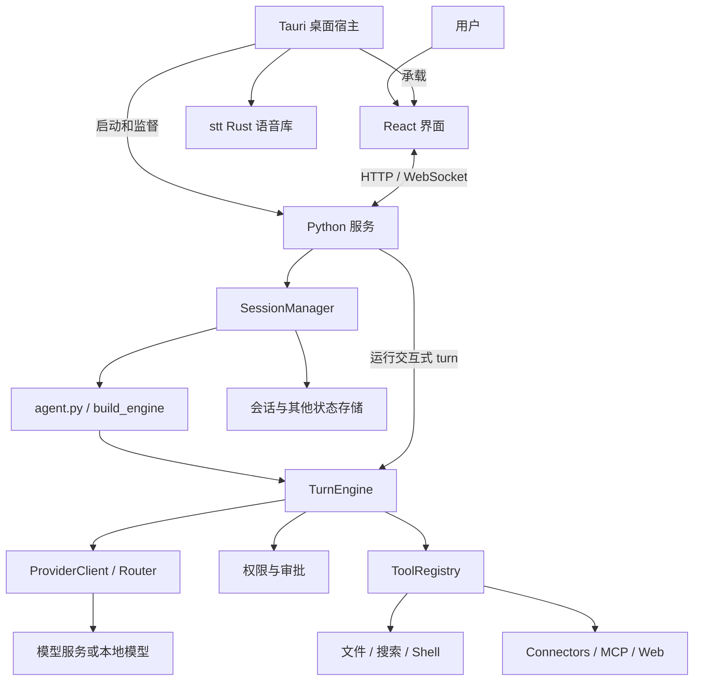
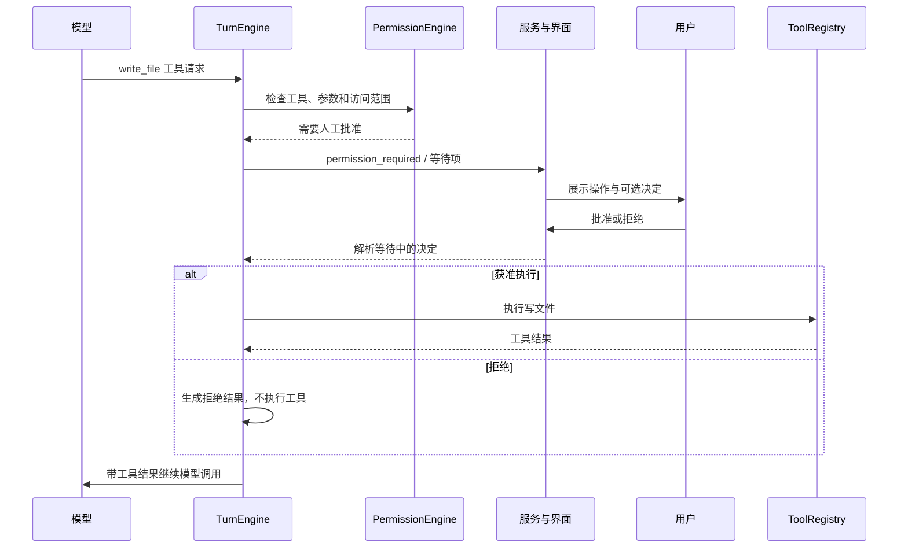

# OpenWorker 项目学习手册

这份手册面向第一次阅读本仓库的开发者，帮助你回答三个问题：**代码放在哪里、模块怎样协作、从哪里开始学习或修改。**

内容依据当前仓库源码整理。目录结构和符号名比行号更适合长期导航，因此下文以文件链接和函数名定位。文中的架构图是职责与数据流的概括，不代表完整的 Python import 依赖图。部分旧注释引用了本仓库没有收录的设计文档；学习时优先核对实现和测试。

只想先了解重点？先看 [Agent 学习路线：浅读 OpenWorker，主学 Hermes](智能体学习路线.md)，其中有精简阅读清单、Hermes 官方资料和动手练习。

## 阅读导航

1. [项目全貌与关键概念](#1-项目全貌与关键概念)
2. [根目录地图](#2-根目录地图)
3. [Python 后端详解](#3-python-后端详解)
4. [前端、桌面外壳和语音](#4-前端桌面外壳和语音)
5. [模块之间怎样协作](#5-模块之间怎样协作)
6. [源码、工作区与运行数据](#6-源码工作区与运行数据)
7. [启动与测试](#7-启动与测试)
8. [推荐学习路线](#8-推荐学习路线)
9. [按问题定位代码](#9-按问题定位代码)
10. [阅读源码时容易误解的地方](#10-阅读源码时容易误解的地方)

## 1. 项目全貌与关键概念

OpenWorker 是一个可以调用模型、读写文件、执行工具、接入外部服务的 AI 助手。它包含桌面界面、本地 Python 服务，以及权限控制、会话持久化、定时任务等运行设施。

主要技术栈：

| 层 | 技术 | 在项目中的作用 |
|---|---|---|
| 界面 | React、TypeScript、Vite | 输入、会话展示、审批卡片、设置页面 |
| 桌面宿主 | Tauri、Rust | 窗口、托盘、系统能力、管理 Python 子进程 |
| 本地服务 | Python、FastAPI、Uvicorn | HTTP API、WebSocket、会话和后台任务 |
| Agent 运行时 | 自有 `TurnEngine`，结合 aisuite | 模型与工具之间的循环、事件、权限控制 |
| 模型适配 | 各供应商 SDK 和兼容接口 | 统一不同模型的消息、流式输出、工具调用 |
| 数据存储 | SQLite、JSONL、JSON、目录文件 | 会话索引、消息日志、各子系统状态和配置 |
| 本地语音 | Rust、cpal、whisper-rs | 录音、模型准备、语音转文字 |

先区分这些词：

| 概念 | 含义 | 主要位置 |
|---|---|---|
| Agent | 运行角色的基础定义：系统提示词、基础工具、是否需要工作区 | `coworker/agents/` |
| Persona | 可配置的专业角色，包含工具能力、连接器、技能等声明 | `coworker/personas/` |
| Skill | 一份可按需加载的工作说明及配套资源 | `coworker/skills/`、角色下的 `skills/` |
| Tool | 模型能请求执行的具体函数，如读取文件 | `coworker/tools/` 等 |
| Provider | 把模型调用统一为运行时可处理的接口 | `coworker/providers/` |
| Session | 持续存在的会话，保存消息、配置和关联工作区等信息 | `sessions.py`、`server/manager.py` |
| Turn | 一次用户输入或后台触发产生的执行过程，可包含多轮模型与工具交互 | `engine.py` |
| Event | 执行过程向界面报告的结构化消息，如工具开始、等待审批 | `events.py` |
| Workspace / Root | 任务所在目录，以及会话获准访问的目录 | `roots.py`、`projects.py` |
| Connector | 某个外部服务的认证、工具或消息接入，如 Slack | `coworker/connectors/` |
| MCP | 通用工具接入协议；本项目既能消费外部 MCP 工具，也能暴露团队工具 | `coworker/mcp/`、`teams/mcp_server.py` |

例如：用户选择一个安全审查 Persona，创建一个 Session；服务组装它的 Agent、工具和模型；一次请求启动一个 Turn，模型加载 Skill 并调用 Tool；Event 把进度显示在界面上。

## 2. 根目录地图

```text
openworker/
├── coworker/             Python 核心：运行时、服务、工具和业务模块
├── surfaces/
│   └── gui/              React 界面及 Tauri 桌面宿主
├── stt/                  可由宿主使用的 Rust 语音识别库
├── tests/                Python 后端测试
├── docs/                 使用说明、配置示例、设计相关资料、本手册
├── packaging/            开发环境初始化、安装包构建、更新清单
├── scripts/              审批 reviewer 评估与语料处理脚本
├── reports/              已保存的 reviewer 评估报告
├── ui-mocks/             独立 HTML 界面原型
├── .github/workflows/    持续集成与发布流程
├── .claude/              开发工具的启动配置
├── pyproject.toml        Python 包、依赖、命令入口、pytest 配置
├── README.md             产品概览和运行方法
├── SECURITY.md           漏洞报告说明
└── LICENSE               许可证
```

这些目录的联系：

- `coworker/` 和 `surfaces/gui/` 通过 HTTP / WebSocket 配合运行。
- `surfaces/gui/src-tauri/` 启动 Python 服务，并直接依赖 `stt/` Rust crate。
- `tests/` 验证后端；前端测试主要在 `surfaces/gui/` 内。
- `packaging/` 把 Python 服务、前端资源和桌面宿主组合成发行包。
- `scripts/` 运行评估，`reports/` 保存部分评估结果；它们不是普通会话的请求入口。
- `ui-mocks/` 是设计参考，正式界面代码在 `surfaces/gui/src/`。
- `.claude/launch.json` 属于开发辅助配置，包含平台相关路径；首次启动以实际脚本和 Vite 配置为准。

## 3. Python 后端详解

### 3.1 三个最重要的入口

先读 [pyproject.toml](../pyproject.toml) 的 `[project.scripts]`，确认启动命令实际调用哪里：

| 命令 | Python 入口 | 用途 |
|---|---|---|
| `openworker-server` | `coworker.server.run:main` | 启动本地 Agent 服务 |
| `openworker` | `coworker.cli:main` | CLI，包含机器加入、运行、管理等命令 |
| `openworker-connectors` | `coworker.connectors.cli:main` | 单独检查和体验连接器 |
| `openworker-acceptor` | `coworker.remote.service:main` | 远程机器接入服务 |
| `ocw` | `coworker.teams.cli:main` | 从命令行操作团队看板和调查日志，也能启动相关 MCP 服务 |

学习普通桌面会话，优先走 `openworker-server → server/run.py → server/app.py`。

### 3.2 `server/`：服务接口与会话生命周期

| 文件 | 职责 | 建议关注 |
|---|---|---|
| [run.py](../coworker/server/run.py) | 命令行参数、启动准备、认证令牌、Uvicorn 启动 | `main()`、`build_app()` |
| [app.py](../coworker/server/app.py) | FastAPI 路由、WebSocket 收发、用户审批响应 | `create_app()`、`ws_session()`、其内部 `run_turn()` |
| [manager.py](../coworker/server/manager.py) | 持有会话引擎、存储、Provider，协调连接器与后台工作 | `SessionManager`、`get_engine()`、`save()` |

`app.py` 处理通信协议，`manager.py` 管理会话及运行资源。交互式 WebSocket 路径中，`app.py` 内的 `run_turn()` 会直接迭代 `engine.run()`，再通过 manager 广播事件和保存状态；不是所有执行都封装在 manager 的一个统一入口里。

这两个文件都比较大，适合按具体路由或方法跳转阅读。

### 3.3 `agent.py` 与 `engine.py`：组装和执行

[agent.py](../coworker/agent.py) 中的 `build_engine()` 负责组装：

- 获取 Agent 的基础提示词和工具。
- 注入工作区说明、记忆、技能目录等上下文。
- 配置模型访问、权限和审批回调。
- 根据运行环境接入连接器、MCP 等能力，返回 `TurnEngine`。

[engine.py](../coworker/engine.py) 中的 `TurnEngine.run()` 负责实际执行。学习时可先概括成：

```text
接收输入 → 更新消息上下文 → 调用模型
                             ↓
                   是否请求调用工具？
                   ├─ 否：满足结束条件后结束本轮
                   └─ 是：检查权限 → 执行或返回拒绝结果
                                      ↓
                             工具结果加入消息上下文
                                      ↓
                                   再调用模型
```

实际实现还处理流式输出、中断、重试、上下文压缩、交互请求、输出截断等情况。

[events.py](../coworker/events.py) 定义执行事件，例如 `TURN_START`、`ASSISTANT_DELTA`、`TOOL_PROPOSED`、`PERMISSION_REQUIRED`、`TOOL_FINISHED`、`TURN_END`。这是理解后端与界面关系的重要文件。

### 3.4 `agents/`、`personas/`、`skills/`：角色与工作方法

| 目录或文件 | 职责 |
|---|---|
| [agents/base.py](../coworker/agents/base.py) | 定义 Agent 基础结构 |
| `agents/chat.py`、`code.py`、`cowork.py` | 不同基础角色的提示词和工具集 |
| `agents/myhelper.py` | 保留的个人助手角色实现，用于兼容相关会话 |
| `agents/registry.py` | 将角色标识解析为可运行的 Agent，与 Persona registry 协作 |
| [personas/manifest.py](../coworker/personas/manifest.py) | Persona 声明格式和解析 |
| `personas/loading.py`、`registry.py` | 加载和注册专业角色 |
| `personas/builtin/` | 仓库内置角色、角色说明、技能和部分展示媒体 |
| [catalog.py](../coworker/catalog.py) | 把角色声明的稳定能力 ID 展开成具体工具 |
| [skills/base.py](../coworker/skills/base.py) | 解析 `SKILL.md`，按需加载完整说明 |
| `skills/store.py` | 技能目录管理和会话中的启停状态 |

典型关系：`Persona 声明 → registry 解析 → Agent / capability 工具集 → build_engine()`。

Skill 默认先提供名称和简述，模型需要时再加载正文。Skill 中写了某项操作，并不等于获得执行权限；工具执行仍要经过权限判断。

角色目录下的 `manifest.md`、`SKILL.md` 是产品运行资源；顶层 `docs/` 中的 Markdown 主要是给开发者阅读的文档。

### 3.5 `providers/`：屏蔽模型接口差异

先看 [providers/base.py](../coworker/providers/base.py)：

- `ProviderClient`：运行时依赖的模型接口。
- `AssistantTurn`：统一后的模型响应。
- `ToolCall`：统一后的工具请求。
- `StreamChunk`、`ModelCapabilities`：流式数据和能力描述。

再看 [router.py](../coworker/providers/router.py) 和 `registry.py`：路由器根据模型标识选择相应客户端，registry 提供供应商描述和构建逻辑。

`openai_provider.py`、`openai_responses.py`、`anthropic_provider.py`、`gemini_provider.py`、`bedrock_provider.py`、`vertex_provider.py` 等处理各自 API 的差异。`capabilities.py`、`matrix.py`、`effort.py`、`errors.py` 辅助处理能力、配置和错误。

学习重点是观察：供应商的原始响应如何变成 `AssistantTurn`，模型声明的工具参数如何变成 `ToolCall`。

### 3.6 `tools/`：把函数暴露给模型

核心是 [tools/registry.py](../coworker/tools/registry.py) 的 `ToolRegistry`：它把可调用函数及其元数据变成模型可见的 JSON Schema，并负责查找和执行工具。Schema 生成复用了 aisuite 的能力。

| 工具文件 | 作用 |
|---|---|
| `files.py` | 带行号和窗口读取能力的文件读取 |
| `search.py` | 代码搜索，优先使用 ripgrep |
| `git.py` | 补充只读 Git 历史工具 |
| `shell.py` | 通过 Executor 抽象执行命令，本地实现维护持久 shell |
| `todo.py` | 维护结构化任务清单 |
| `ask.py` | 向用户提问 |
| `directories.py` | 请求增加目录访问范围 |
| `plan.py` | 提交计划并等待决定 |
| `toolreq.py` | 请求安装或提供缺失的 CLI 工具 |
| `connreq.py` | 请求或授予连接器访问 |
| `subagent.py` | `explore` 只读研究子 Agent |

注意两个边界：

1. `ToolRegistry` 不负责完整权限审批；`TurnEngine` 在执行前调用权限系统。
2. `ask_user`、目录申请等交互工具会被引擎特殊处理，工具函数本身可能只是 Schema 载体和兜底实现。

项目的一部分基础工具来自 aisuite，不是所有模型可见工具都能在这个目录找到同名实现。

### 3.7 权限、审批和审计

| 文件 | 职责 |
|---|---|
| [permissions.py](../coworker/permissions.py) | 决定允许、拒绝或请求用户批准 |
| [risk.py](../coworker/risk.py) | 工具风险分类 |
| [reviewer.py](../coworker/reviewer.py) | 自动审批场景下，使用另一模型审查具体操作 |
| `readonly.py` | 判断 shell 命令是否符合只读规则 |
| `overrides.py` | 用户侧工具策略覆盖 |
| `roots.py` | 会话可访问目录及读写范围 |
| `workspace_trust.py` | 用户对工作区声明的命令许可作出的信任决定 |
| `provenance.py` | 记录 Agent 在会话中创建或下载文件等来源事实 |
| `session_facts.py` | 记录会话已知环境和外来信息等事实 |
| `audit.py` | 持久化审计记录 |

阅读顺序建议：`risk.py → permissions.py → engine.py 中的审批调用 → reviewer.py`。

Reviewer 只在相应的待审批路径参与判断，不能把权限系统的硬拒绝改成允许。审批界面本身也不是权限控制的唯一位置。

### 3.8 会话、项目、上下文和记忆

| 文件或目录 | 职责 |
|---|---|
| [sessions.py](../coworker/sessions.py) | 单个会话的记录结构 |
| [conversations.py](../coworker/conversations.py) | 会话索引和消息日志读写 |
| `project.py` | 将工作区及全局的 `AGENTS.md` 说明加入上下文 |
| `projects.py` | 项目标识与用户命名；同一 Git 仓库的 worktree 可归于同一项目 |
| `config.py` | 默认、全局、工作区 TOML 配置的分层加载 |
| `environment.py`、`runtime_context.py` | 运行环境信息与上下文支持 |
| `attachments.py`、`pdf_support.py` | 用户附件及 PDF 的模型输入处理 |
| `compaction.py` | 控制发送给模型的长历史，摘要或裁剪出站上下文 |
| `toolresult.py` | 限制工具结果进入上下文的体积 |
| `memory/` | 记忆接口、SQLite 实现、设置和模型可调用的记忆工具 |

会话历史和长期记忆是不同抽象。会话消息用于还原一段对话；记忆模块保存可供以后检索使用的信息。

上下文压缩主要改变发送给模型的视图，不应理解为直接删除已保存的完整对话日志。

### 3.9 `connectors/`、`mcp/`、`web/`：外部能力接入

**`connectors/` 面向具体业务服务。**

- `descriptors.py`、`setup.py`、`catalog_copy.py`：连接器配置、认证步骤与界面说明。
- `accounts.py` 及服务专用账号模块：多账号、默认账号等管理。
- `tool_defs.py`、`integration_tools.py`、`chat_tools.py`、`email_tools.py`：外部服务工具。
- `base.py`、`adapters.py`、`gateway.py`：外部消息的抽象、接收适配和路由。
- `relay_client.py`、`github_relay.py`、`machine_poll.py`：不同的托管事件传输方式。
- `senders.py`、`github_send.py`：向外部平台发送内容。
- `parked.py`：暂存未被允许的发送者消息。
- `browser_automation.py`：可选的 Playwright 浏览器操作。
- `fake.py`、`cli.py`：模拟连接器与独立调试入口。
- `experimental/`：当前主要是预留的实验性包位置，不能据目录名推断已有完整实现。

**`mcp/` 面向标准协议。**

[client.py](../coworker/mcp/client.py) 管理外部 MCP 会话和传输，`config.py`、`oauth.py` 负责配置与授权，`tools.py` 把外部工具包装成 `ToolRegistry` 可执行的工具。同步 registry 与异步 MCP 会话之间有桥接逻辑，排查卡住或线程问题时要关注这一层。

**`web/` 提供网页搜索与读取。**

`providers.py` 适配搜索服务，`tool.py` 暴露搜索工具，`fetch.py` 获取具体页面，`guard.py` 检查模型给出的目标地址。

它们的共同点是：最终将可执行能力提供给 Agent；差别是业务适配方式和传输协议。MCP 不是所有外部连接器都必须经过的中间层。

### 3.10 后台运行：定时任务、消息和等待用户

| 位置 | 职责 |
|---|---|
| `automation/models.py`、`store.py` | 定时任务定义和执行历史 |
| `automation/scheduler.py` | 检查到期任务，调用注入的 runner |
| `automation/tools.py` | 模型可调用的任务管理工具 |
| `selfwake.py` | 按时间或后台任务完成事件唤醒会话 |
| `subscriptions.py`、`subscription_sync.py` | 会话订阅外部消息源，以及与托管端同步 |
| `inbox.py` | 持久化等待用户回答的交互项 |
| `inbox_routing.py`、`interactions.py` | 把交互项路由到可回答的位置或外部消息按钮 |
| `unattended.py` | 会话无人值守状态 |
| `unrouted.py` | 记录无法投递的消息和后台失败 |
| `connections.py` | 角色、会话层面的连接器启用关系 |

`inbox.py` 名字容易误导：它保存的是所有持久化等待项；界面上显示的 Inbox 是其中满足可见性条件的集合。

无人值守状态改变的是“到哪里找用户回答”，不是自动提升操作权限。调度器也不直接实现模型循环，而是把执行交给注入的运行函数。

### 3.11 `teams/`：多 Agent 协作的持久化基础

| 文件 | 职责 |
|---|---|
| `registry.py` | 团队、负责人、成员与会话的关系 |
| `model.py` | 工作项、状态、参与者等数据结构 |
| `store.py` | 团队事件日志及看板投影 |
| `journal.py` | 可跨团队生命周期保留的调查记录 |
| `chat.py` | 群聊消息与阅读进度 |
| `tools.py` | 暴露给 Agent 的看板和日志操作 |
| `proposals.py` | 结构化提案意图 |
| `summary.py` | 面向界面的只读汇总 |
| `attachments.py`、`artifacts.py` | 附件和已发布成果文件版本 |
| `tokens.py` | 外部客户端身份令牌 |
| `dialect.py` | 本地直接访问与远程 API 访问的统一边界 |
| `cli.py`、`mcp_server.py` | 命令行和外部 MCP 访问入口 |

这里的看板状态由追加的事件形成投影。修改工作项会追加新事件，而不是把历史当成普通可覆盖记录。

`tools/subagent.py` 的短期只读探索子 Agent，与 `teams/` 中有持久会话、角色和看板的团队，是不同层次的协作机制。

### 3.12 `remote/`、`cloud.py`：跨机器能力

`remote/acceptor.py` 处理控制端接入，`joiner.py` 处理执行机器主动连接控制端；`identity.py`、`channel.py`、`registry.py`、`stores.py` 等支持机器身份、通信和持久化。`provision.py`、`cloudproxy.py`、审计相关文件支持部署和代理路径。

`remote/service.py` 是可独立运行的接入服务，本身不运行 Agent 引擎。真正执行任务的机器仍运行已有 Python 服务与引擎。

`cloud.py` 提供托管登录、连接器等客户端能力，`secrets.py` 提供本地凭据存储接口。远程模式和本地模式有共同的执行核心，但启动与通信路径不同。

初学时先理解本地会话，再阅读 [remote-machines.md](remote-machines.md)。

### 3.13 其他支持模块

- `tui/app.py`：Textual 终端界面，直接在进程内消费引擎事件；可作为另一种界面实现参考。
- `testing/fake_slack/`：Slack 测试替身，支持集成场景验证。
- `toolchain.py`：定位工作所需 CLI，部分受管理工具的安装逻辑。
- `basedir.py`：处理受限基础目录规则。
- `statelock.py`：防止多个运行实例同时占用同一个状态目录。
- `clock.py`：向模型提供时间工具。
- `mentions.py`：持久化外部提及线程与会话的映射，支持去重、路由和重建线程回复授权。

## 4. 前端、桌面外壳和语音

### 4.1 `surfaces/gui/src/`：正式界面

| 位置 | 职责 |
|---|---|
| [main.tsx](../surfaces/gui/src/main.tsx) | 初始化主题、语言等，挂载 React 应用 |
| [App.tsx](../surfaces/gui/src/App.tsx) | 应用主界面与会话交互协调 |
| [api.ts](../surfaces/gui/src/api.ts) | HTTP 调用、WebSocket、认证及远程机器路径处理 |
| `types.ts`、`cardPayloads.ts` | 界面使用的数据类型和卡片数据 |
| `itemsFromMessages.ts` | 将保存的消息转换成可展示的历史条目 |
| `streamGate.ts`、`gateReconciliation.ts` | 流式状态与交互等待项的协调 |
| `components/` | 会话、输入、审批、设置、团队等 React 组件 |
| `connectors/` | 连接器图标、注册与视觉辅助；实际业务调用主要在后端 |
| `providers/` | 模型供应商相关界面资源 |
| `locales/`、`i18n.ts` | 翻译资源和国际化初始化 |
| `gallery/` | 开发用组件展示、场景数据和展示契约测试 |
| `tauri.ts` | 桌面宿主能力的前端适配 |
| `routes.ts`、`paths.ts` | 路由和路径相关辅助 |
| `useMachineData.ts`、`useRoots.ts` | 机器数据、目录状态相关 Hook |
| `styles.css`、`tailwind.css`、`theme.ts`、`fonts/` | 样式、主题和字体 |

跟踪普通输入时先找 `components/Composer.tsx`；看消息展示时找 `Transcript.tsx`；看审批时找 `ApprovalCard.tsx`；然后沿调用关系追到 `App.tsx` 和 `api.ts`。

`src/gallery/` 与根目录 `ui-mocks/` 不同：前者会使用真实 React 组件和保存的场景数据，后者是独立 HTML 原型。开发环境中的 `/#/gallery` 可以用于查看组件展示。

### 4.2 前端周边目录

- `e2e/`：Playwright 浏览器测试，模拟 HTTP 和 WebSocket，通常无需真实 Python 服务或模型。
- `e2e-live/`：对真实后端的测试；部分仅检查 API，完整任务测试需要模型配置。
- `scripts/`：场景导出、展示契约等开发辅助脚本。
- `assets/`：界面相关静态资源。
- `vite.config.ts`：开发服务地址、构建和开发令牌注入。
- `vitest*.config.ts`、`playwright*.config.ts`：不同测试入口的运行配置。

### 4.3 `src-tauri/` 和 `stt/`

[Tauri 的 lib.rs](../surfaces/gui/src-tauri/src/lib.rs) 负责桌面宿主行为，包括启动与监督 Python sidecar、注入服务地址和令牌、托盘及语音相关命令。

`tauri.conf.json` 管构建与窗口等配置，`capabilities/` 管 Tauri 能力声明，`icons/` 是安装包与窗口图标。它们与 Python 的工具权限系统属于不同层次。

[stt/src/lib.rs](../stt/src/lib.rs) 是独立语音识别库，负责麦克风采集、模型准备和转写，不依赖 Tauri。Tauri 的 Cargo 配置通过路径依赖引入它。因此当前实现中它是宿主使用的 Rust 库，不应简单理解为另一个 Python HTTP 服务。

## 5. 模块之间怎样协作

### 5.1 本地运行架构



浏览器开发模式手动启动 Python 服务和 Vite；桌面模式由 Tauri 管理 Python 服务。两种方式复用主要前端和后端代码。

### 5.2 一条消息从输入到完成

1. 用户在 Composer 输入，界面交互逻辑调用 `api.ts` 的 `userMessage()`。
2. WebSocket 向 `/ws/session/{session_id}` 发送 `type: "user_message"` 的消息。
3. `app.py` 的 `ws_session()` 接收消息，结合 `SessionManager` 获取或恢复会话引擎。
4. `run_turn()` 调用 `engine.run()`，模型调用经 Provider 抽象完成。
5. 如果模型请求工具，引擎检查权限；需要人工决定时发出交互事件并等待结果。
6. 用户决定经 WebSocket 返回，服务解析待处理交互，引擎继续执行或处理拒绝。
7. 工具结果加入对话上下文，模型可继续调用工具，也可生成最终回答。
8. 服务广播引擎事件，在检查点及结束时调用 `manager.save()`；界面更新消息和状态。

注意 `TURN_END` 是引擎事件，服务还会发送 `turn_done` 协议消息；不要把两者当作完全相同的定义。

### 5.3 一次写文件审批



这是人工审批路径的简化示例；已有授权、自动 reviewer、硬拒绝和后台持久化等待会产生其他分支。

### 5.4 外部消息与定时任务

- 外部消息：`adapter / relay → gateway 校验 → 会话路由与订阅 → SessionManager → TurnEngine`。回复通过相应发送工具进行，并不是 gateway 自动绕过权限发送。
- 定时任务：`automation store → scheduler 到期检查 → 注入的 runner → 服务协调执行 → 会话和运行记录`。
- 自唤醒：`selfwake 记录触发条件 → 后台检查 → 恢复对应会话`。

这些入口会复用 Agent 执行核心，但会话选择、审批呈现和结果路由各有不同。

## 6. 源码、工作区与运行数据

这三类目录必须分开理解：

| 类别 | 示例 | 保存什么 |
|---|---|---|
| 项目源码 | 克隆出的 `openworker/` | 程序代码、测试、文档 |
| 任务工作区 | 启动时 `--cwd` 指定的目录或会话 scratch 目录 | Agent 操作的文件和交付物 |
| 运行状态目录 | 默认 macOS/Linux 的 `~/.config/coworker` | 会话记录、配置、凭据及各类运行状态 |

状态目录解析以 [secrets.py](../coworker/secrets.py) 的 `state_dir()` 为准：先检查 `COWORKER_STATE_DIR`；有 `OPENWORKER_BASE_DIR` 时使用其下 `state`；普通 Windows 环境使用 `%APPDATA%/coworker`；通常 macOS/Linux 使用 `~/.config/coworker`。

主要持久化关系：

- `ConversationStore` 使用 SQLite 索引与 `conversations/<id>.jsonl` 消息日志；不是把完整历史都塞进一个数据库字段。
- 全局配置在状态目录的 `config.toml`；工作区配置在 `<workspace>/.coworker/config.toml`。
- 全局技能位于状态目录的 `skills/`，项目技能位于 `<workspace>/.coworker/skills/`。
- 记忆、自动化、团队、等待项等模块各有自己的存储抽象；不要假设所有状态都由 `sessions.py` 保存。
- 本地凭据通过 `SecretStore` 访问；当前实现包含受文件权限保护的 JSON 存储，不应从类名推断为操作系统钥匙串或加密数据库。

在开发中排查“重启后还在”的行为时，先找对应 store 和状态目录，而不是只搜索源码工作区。

## 7. 启动与测试

### 7.1 浏览器开发模式

根据当前项目声明，需要 Python 3.10+、Node 20+。以下命令适用于 macOS/Linux，在仓库根目录开始执行。

初始化 Python 环境：

```bash
bash packaging/setup_dev_env.sh
```

脚本会创建 `.venv` 并安装开发及相关可选依赖。准备一个练习目录并启动服务：

```bash
mkdir -p "$HOME/openworker-playground"
.venv/bin/openworker-server --cwd "$HOME/openworker-playground" --port 8765
```

在第二个终端，从仓库根目录执行：

```bash
cd surfaces/gui
npm install
npm run dev
```

当前 [vite.config.ts](../surfaces/gui/vite.config.ts) 固定使用 **1420** 端口，因此浏览器入口是 `http://localhost:1420`。部分旧 README 仍写 5173，实际以当前配置和终端输出为准。

先启动服务，再启动 Vite：浏览器开发模式在 Vite 启动时读取服务生成的认证令牌。服务重启后，如果令牌改变，需要重新启动 Vite。首次真实对话还需要在设置中配置可用模型。

### 7.2 桌面开发模式

准备好 Rust 工具链、Python 环境和前端依赖后，在 `surfaces/gui/` 执行：

```bash
npm run tauri dev
```

该方式由 Tauri 启动并管理 Python 服务。Tauri 会选择自己的服务端口并注入前端，不要假设桌面模式也固定使用 8765。初学建议先走浏览器模式，减少同时需要排查的构建层。

### 7.3 测试分层

| 层次 | 位置 | 适合验证什么 |
|---|---|---|
| Python 单元及集成测试 | `tests/` | 引擎、权限、模型适配、存储、服务协议 |
| 前端单元测试 | `src/**/*.test.ts(x)` | 组件、状态转换、消息回放等 |
| 模拟浏览器 E2E | `e2e/` | 输入、审批、设置等界面流程 |
| 真实后端测试 | `e2e-live/` | API 形状、完整真实执行链路 |

先跑两个学习价值高的后端文件，在仓库根目录执行：

```bash
.venv/bin/pytest tests/test_engine.py tests/test_tools_permissions.py -q
```

前端检查在 `surfaces/gui/` 执行：

```bash
npx tsc --noEmit
npm test
```

需要浏览器 E2E 时，先安装 Chromium：

```bash
npx playwright install chromium
npm run e2e
```

全量后端测试可以运行 `.venv/bin/pytest tests -q`。测试目录里的模拟模型可避免真实模型调用，但不要把这一点推及所有 live 测试；完整 live 场景需要服务与模型配置，可能产生模型调用费用。

[CI 配置](../.github/workflows/ci.yml) 展示了项目实际使用的三组检查：Python 测试及覆盖率、前端类型与单元测试、模拟浏览器 E2E。

## 8. 推荐学习路线

### 第一阶段：能解释一次工具调用

阅读顺序：

1. [test_engine.py](../tests/test_engine.py) 的 `ScriptedProvider` 和 `_engine()`。
2. `test_no_tool_turn`：纯文本回答。
3. `test_tool_turn_order_and_execution`：读文件，再回答。
4. `test_write_requires_approval_then_approved`：批准写入。
5. `test_denied_tool_yields_error_and_continues`：拒绝后继续。
6. 回到 `providers/base.py`、`events.py` 和 `TurnEngine.run()` 查对应实现。

完成标准：能画出“模型请求 → 权限判断 → 工具结果 → 下一次模型调用”，并解释为什么一次 Turn 可以包含多次模型请求。

### 第二阶段：能跟踪前后端消息

依次追踪 `Composer.tsx → App.tsx → api.ts 的 userMessage() → app.py 的 ws_session()/run_turn() → engine.run()`，再反向追踪事件如何返回界面。

可以在 `run_turn()`、`TurnEngine.run()` 和工具执行入口设置断点。记录用户消息、工具参数、事件类型和会话 ID，不要只看最终返回文本。

完成标准：能说明实时消息展示和重新打开会话后的历史回放分别走哪里。

### 第三阶段：理解组装、权限和存储

阅读 `agent.py`、角色 registry、`ToolRegistry`、`PermissionEngine`、`ConversationStore`。对照 `tests/test_tools_permissions.py` 查看只读允许、写入审批、路径越界和计划模式行为。

完成标准：能解释“工具存在于 registry”“角色允许使用它”“本次调用获准执行”之间的区别。

### 第四阶段：做一个小实验

在本地练习分支里扩展模拟模型测试：

1. 模型请求读取临时文件。
2. 模型请求写入另一个临时文件。
3. 审批回调拒绝写入。
4. 模型收到拒绝结果后返回说明。

先预测事件顺序，再运行测试检查：写入目标没有生成、工具结果表示拒绝、会话仍正常结束。通过这个练习把模型、权限、工具和事件串起来。

### 第五阶段：按兴趣选择扩展方向

| 方向 | 下一组阅读位置 |
|---|---|
| 模型兼容 | `providers/base.py`、`router.py`、一个具体 provider 及相关测试 |
| 工具开发 | `tools/registry.py`、一个工具工厂、`catalog.py`、风险分类 |
| 专业角色 | `personas/manifest.py`、一个内置角色及其技能 |
| 外部集成 | 一个 connector 的描述、账号管理、工具定义及调用实现 |
| MCP | `mcp/client.py`、`mcp/tools.py`、对应测试 |
| 自动化 | `automation/scheduler.py`、store、manager 中的 runner |
| 多 Agent | `teams/model.py`、`store.py`、`registry.py`、`tools.py` |
| 桌面能力 | `src/tauri.ts`、`src-tauri/src/lib.rs`、`stt/src/lib.rs` |

## 9. 按问题定位代码

| 想理解或修改的行为 | 优先查看 | 同时检查 |
|---|---|---|
| 模型不停调用工具、不能结束 | `engine.py` | Provider 返回、迭代限制、截断续跑 |
| 工具参数或返回格式有问题 | `tools/registry.py`、具体工具 | Schema、`toolresult.py`、provider 转换 |
| 写文件为什么被拒绝 | `permissions.py`、`roots.py` | 风险分类、工作区授权、审批结果 |
| 自动审批为什么中断 | `reviewer.py`、`engine.py` | 原始权限决定、reviewer 结果和审计记录 |
| 新角色没有预期工具 | `personas/`、`catalog.py`、`agent.py` | 能力声明、上下文条件、会话连接器配置 |
| 模型切换后行为异常 | `providers/router.py`、相关 provider | GUI 模型参数、能力设置、会话状态 |
| 消息不显示或重复显示 | `App.tsx`、`api.ts`、`itemsFromMessages.ts` | WebSocket 事件与持久化消息是否一致 |
| 审批卡片卡住 | `app.py`、`inbox.py`、相关卡片组件 | 等待项 ID、回答处理、重连协调 |
| 会话重启后丢失 | `conversations.py`、`manager.save()` | 状态目录、索引、JSONL 文件 |
| 外部消息未触发会话 | `connectors/gateway.py`、adapter | 发送者授权、订阅、暂存或未路由记录 |
| 定时任务未执行 | `automation/scheduler.py` | 启用状态、时区、到期时间、重叠执行 |
| 团队看板状态不对 | `teams/store.py`、`model.py` | 事件记录、角色权限、只读 summary |
| 桌面能打开但后端不可用 | `src-tauri/src/lib.rs`、`server/run.py` | Python 服务路径、启动日志、认证令牌 |
| 麦克风或转写出错 | `stt/src/lib.rs`、Tauri 语音命令 | 设备权限、模型安装与校验状态 |

## 10. 阅读源码时容易误解的地方

1. **产品叫 OpenWorker，Python 包叫 `coworker`。** 搜索时两种命名都可能出现。
2. **自有引擎和 aisuite 各有职责。** 主循环在本仓库，部分工具和元数据能力复用 aisuite。
3. **`agent.py` 与 `agents/` 不同。** 前者组装引擎，后者定义基础角色。
4. **`project.py` 与 `projects.py` 不同。** 前者处理工作区说明，后者处理项目身份。
5. **`sessions.py` 不等于会话系统的全部。** 执行管理在 manager，持久化主要在 conversations 等 store。
6. **异步引擎不代表所有 SDK 和工具都是异步。** 引擎使用线程包装部分阻塞调用；MCP 另有同步到异步的桥接。
7. **工具可以不在 `tools/`。** 记忆、自动化、团队、连接器、MCP 都能提供工具。
8. **无界面运行仍需要权限处理。** 后台触发和无人值守不意味着自动允许写入或发送。
9. **模拟 E2E 通过不代表真实模型链路通过。** 它主要验证界面和协议消费；真实链路要看 live 测试。
10. **注释可能比实现旧。** 例如 `events.py` 的旧说明提及尚无流式输出，但枚举和运行逻辑已有流式事件；GUI README 的旧端口也与当前 Vite 配置不同。

建议每读一个模块，记下：**它接收什么、依赖谁、持有哪些状态、产生什么结果、由哪个测试证明行为。** 这样形成的笔记可以直接用于后续排查和修改。
